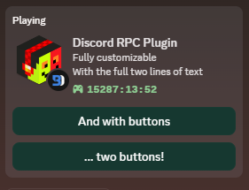

# AutoStartRichPresence - [Download](https://betterdiscord.app/Download?id=1301)

Automatically starts a custom Rich Presence application when you start Discord. Now with support for multiple rich presence profiles!

Original idea by Lucario. Lucario's original plugin to do this is broken, so I wrote my own.
This is not Lucario's original code, but I did try to keep the names of the settings the same.

## Install

Just download the [AutoStartRichPresence.plugin.js](AutoStartRichPresence.plugin.js) file and put it in your plugins folder

Or you could download from the bd website...

## Usage

Enable the plugin and use the settings button to open settings.

## Settings

- **Client ID** (required): The client/application ID of your application. It is a required field, but you do not have to change the value. Only change it when you want to use asset keys instead of just plain links. [Get one here](https://discord.com/developers/applications)
- **Activity Name** (required): The title that will show up as the "Playing ..." status content.
- **Activity Details**: The details of the activity. Also known as the 'first line' of the status.
- **Activity State**: The state of the activity. Also known as the 'second line' of the status.
- **Activity Button 1 Text** (optional): The text for the first button (required when Button 1 URL is set!). **Max length is 32 characters**
- **Activity Button 1 URL** (optional): The URL or asset key for the first button. Note that you will need to change the Client ID when using asset keys.
- **Activity Button 2 Text** (optional): The text for the second button (required when Button 2 URL is set!). **Max length is 32 characters**
- **Activity Button 2 URL** (optional): The URL or asset key for the second button.
- **Activity Small Image Key** (optional): The URL or asset key for the small image. Note that you will need to change the Client ID when using asset keys.
- **Activity Small Image Text** (optional): The text that shows up when hovering over the small image. Required to have the Small Image Key set in order to show up!
- **Activity Large Image Key** (optional): The URL or asset key for the small image. Note that you will need to change the Client ID when using asset keys.
- **Activity Large Image Text** (optional): The text that shows up when hovering over the large image. Required to have the Large Image Key set in order to show up!
- **Enable Timestamp** (optional): Select if you want to show the amount of time that has past since you started running the plugin.
- **Listening Status** (optional, **Keep default!**): Select if you want to switch the Playing status to a Listening status. __**Discord doesn't want you to do this, use with care! Keep it off!**__
- **Disabled When Activity** (optional): Select if you want the activity to disappear when there is another activity. Like when you're playing Minecraft.

## Troubleshooting

### "Failed to set Rich Presence activity."

Ensure that your button labels are less than 32 characters long. The button URLs should not be excessive in length. Test with https://example.com.

### Images do not appear.

If you just uploaded your asset, then Discord still needs to cache it.
Please be patient.

You can check if it is cached at the assets page of your application.
After uploading, you will see your uploaded asset. If you refresh the page, it will be gone.
But after a while it will show up again. That is when they have cached it.

You possibly need to reload Discord then. If it still doesn't show up, make sure you have the correct Client/Application ID and the correct asset key.

### The Rich Presence is not showing 10 seconds after it was started, and there are no visible errors.

- Make sure the plugin is on.
- Go to User Settings > Game Activity and turn on Display currently running game as a status message. If it was already on, turn it off, wait 5 seconds, and turn it back on.
- Disable the experimental RPC event injection setting if you have it enabled, and restart Discord.
- Wait 3 hours while your Discord client is continuously open. Sometimes, Discord may take a long time to display or update your Rich Presence.

